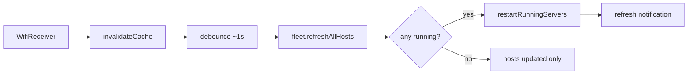
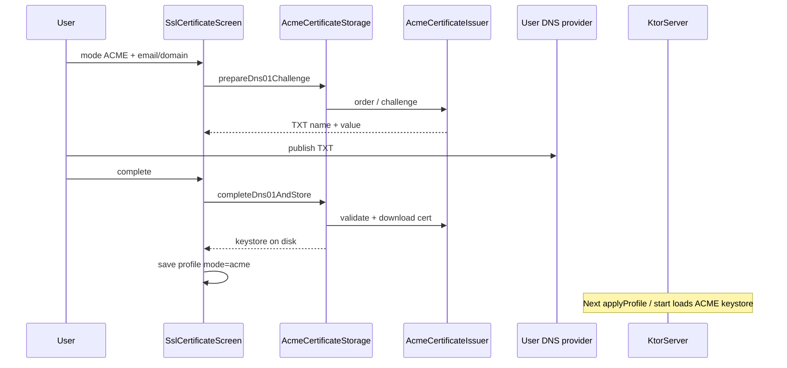

# Runtime diagrams

Mermaid overviews for onboarding. Details: [runtime-lifecycle.md](runtime-lifecycle.md), [../features/ssl-certificates-flow.md](../features/ssl-certificates-flow.md).

---

## Server start / stop

```mermaid
sequenceDiagram
  participant UI as UI / BootReceiver
  participant SM as ServerManager
  participant NS as NotificationService
  participant Fleet as ServerFleet
  participant S as Server (Ktor/FTP)
  participant WL as WakeLock

  UI->>SM: startFleetService / stop*
  SM->>NS: startForegroundService / command intent
  NS->>NS: enterForeground (specialUse)
  NS->>Fleet: startServer / startOnBoot / stop*
  Fleet->>S: applyProfile + start/stop
  S-->>Fleet: statusFlow Started/Stopped/Error
  Fleet-->>NS: anyActive?
  NS->>NS: update / teardown notification
  Note over SM,WL: On Started acquire; release only when idle
```

---

## Wi‑Fi host refresh



---

## ACME DNS-01 (product path)



HTTP-01 (`/.well-known/acme-challenge/…`) may also be used by the issuer when applicable; DNS-01 is the documented product path in the [user guide](../user/guide.md#lets-encrypt-outline).
